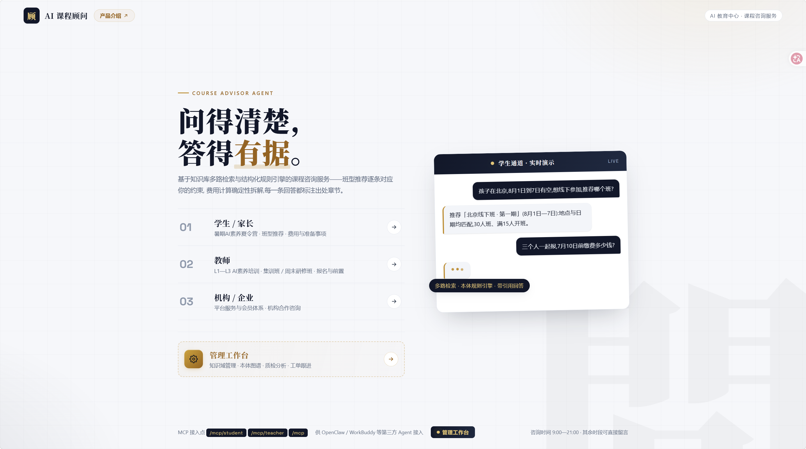
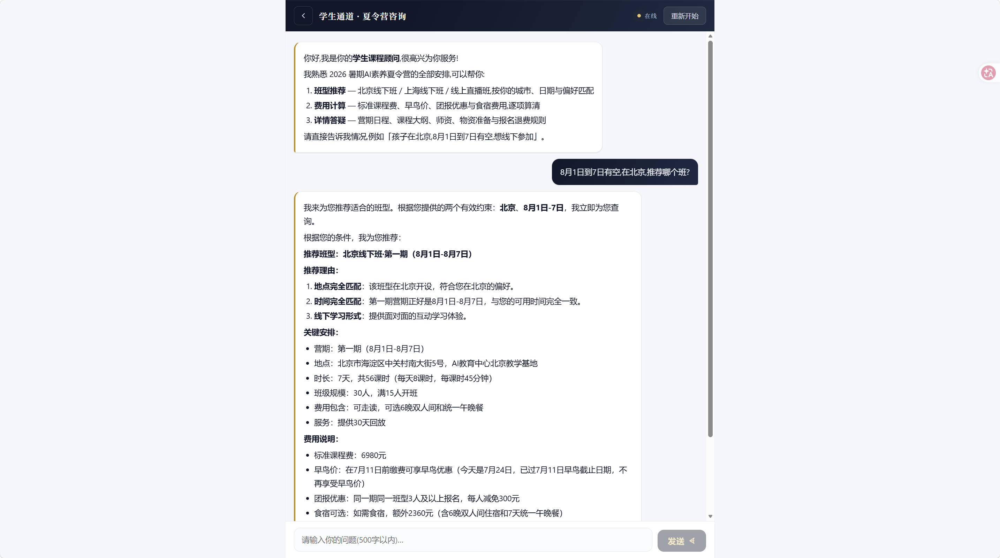
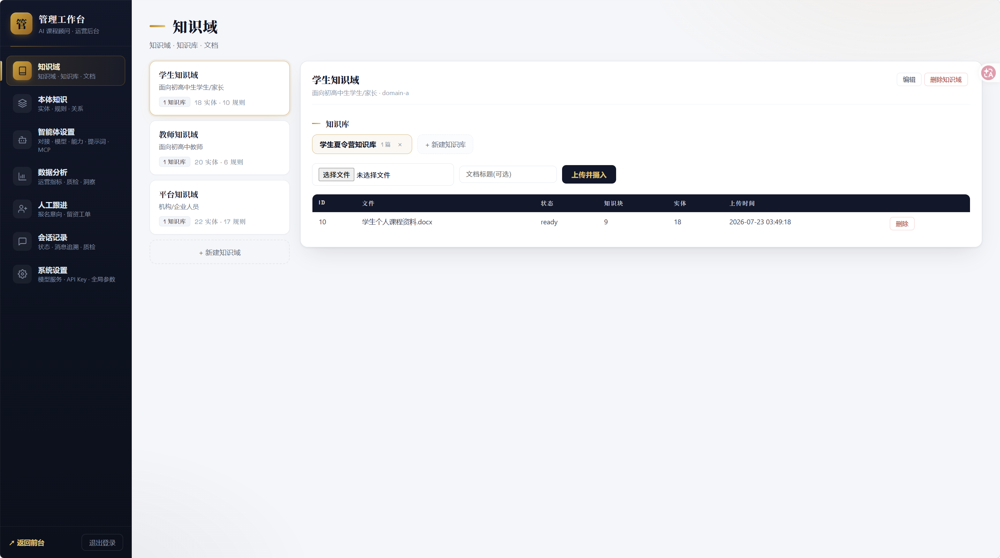
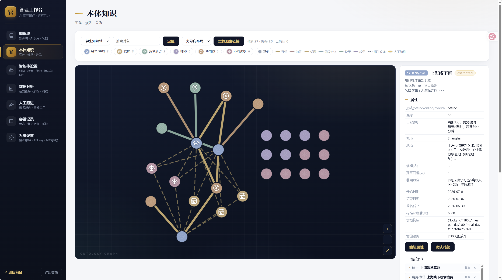
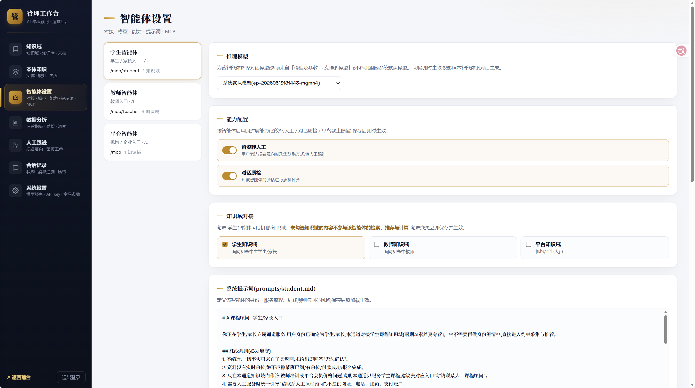
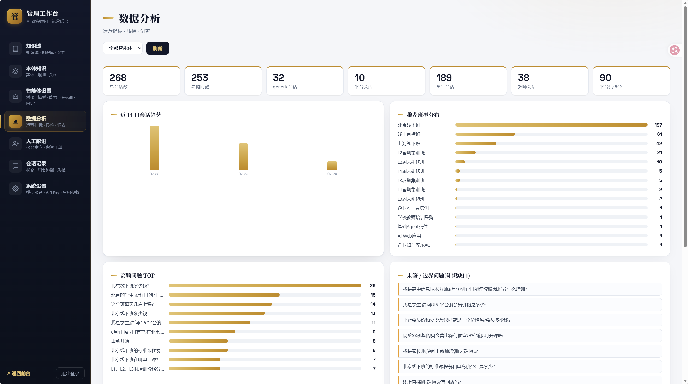
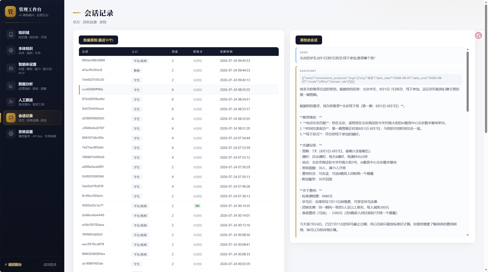
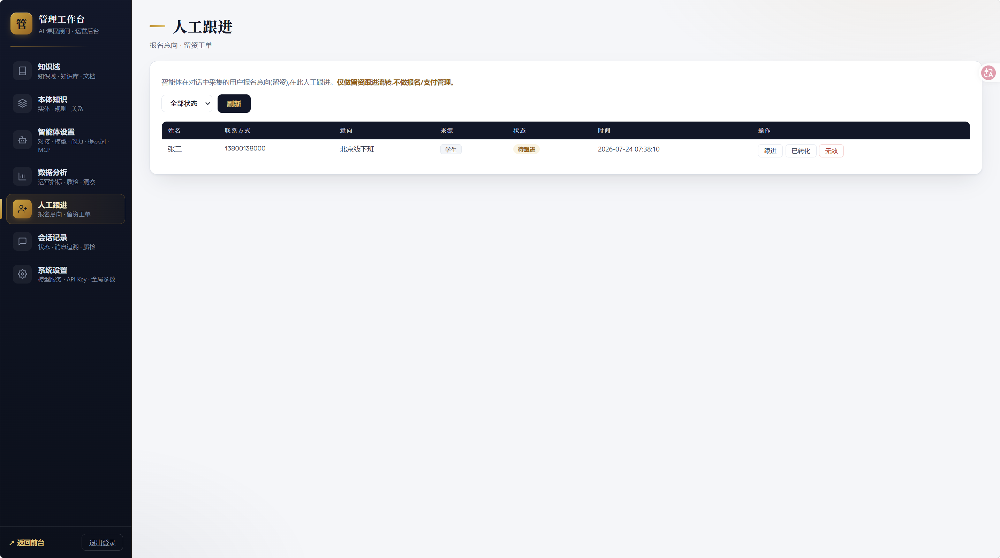

<p align="center">
  
</p>

<h1 align="center">智课顾问 · AI Course Advisor</h1>

<p align="center">
  <strong>AI 原生课程顾问智能体运营平台</strong><br/>
  结构化本体 · 多路检索 · 规则引擎零硬编码 · MCP 优先
</p>

<p align="center">
  <a href="https://edu-demo.openneo.ai/"><strong>🎥 在线体验</strong></a>
  &nbsp;·&nbsp;
  <a href="https://edu-demo.openneo.ai/intro.html"><strong>📖 产品介绍</strong></a>
  &nbsp;·&nbsp;
  <a href="https://github.com/OpenNeo-AI/ai-course-agent-platform"><strong>⭐ GitHub</strong></a>
</p>

---

## 这是什么

「智课顾问」是一个将 **AI 智能体** 与 **知识库运营** 打通的课程咨询平台。

传统 chatbot 靠提示词硬背业务规则，一问深就幻觉。「智课顾问」的做法不同——课程信息被抽取为结构化本体（Ontology），早鸟折扣、团报叠加、退费阶梯、前置要求等业务规则全部对象化存入知识库，由通用规则引擎确定性执行，**代码中不包含任何一条业务数值**。回答时三路并行检索（向量语义 + FTS5 中文关键词 + 本体精确匹配），每个结论都标注出自哪份文档的哪个章节。

它同时也是一个 **智能体运营平台**：管理员在 portal 中上传知识文档即自动抽取入库、可视化本体图谱、按智能体配置知识域边界、查看对话质检与运营分析、跟进留资工单。第三方 Agent 可通过 MCP over HTTP 接入，范围自动收敛到该智能体对接的知识域。

> 🏆 本项目为「OPC 接单吧·首届软件与智能体开发大赛」参赛作品，25 组官方验收用例全部通过。

---

## 在线演示

| 入口 | 地址 | 说明 |
|------|------|------|
| 总入口 | [edu-demo.openneo.ai](https://edu-demo.openneo.ai/) | 落地页，三通道入口 |
| 学生/家长 | [/s](https://edu-demo.openneo.ai/s) | 暑期 AI 素养夏令营咨询 |
| 教师 | [/t](https://edu-demo.openneo.ai/t) | L1–L3 教师 AI 素养培训咨询 |
| 平台/机构 | [/c](https://edu-demo.openneo.ai/c) | 平台服务与合作咨询 |
| 管理工作台 | [/portal](https://edu-demo.openneo.ai/portal) | 知识治理 · 质检 · 工单 · 分析（demo/demo1234） |
| 产品介绍 | [/intro.html](https://edu-demo.openneo.ai/intro.html) | 产品展示页 |

---

## 平台截图

<p align="center">
  
  
</p>

<details>
<summary>📸 更多截图（管理工作台）</summary>
<p align="center">
  
  
  
  
  
  
</p>
</details>

---

## 核心理念

### 1. 结构化本体，而非死记硬背

课程信息（班型、营期、地点、师资、费用）经 LLM 抽取为 **8 类对象 × 10 类链接** 的本体网络。同一实体在不同章节自动合并，派生关系（归属链路、前置链、规则适用）由引擎计算。portal 提供可视化图谱，支持搜索、筛选、编

辑、增删链接，全部操作可审计。

### 2. 规则全部对象化，代码零业务数值

```yaml
# 任何一条业务规则都是库内一条记录，由通用解释引擎执行
kind: early_bird
params:
  deadline: "2025-07-01"
  discount: 1000          # 早鸟立减额
scope:
  applies_to: [北京线下班, 上海线下班]

kind: stack_policy
params:
  strategy: best_one      # 叠加策略：取最高一项
```

引擎读取规则 → 按约束匹配 → 确定性输出。**整个代码库中没有一行 "if 早鸟 then 减 1000" 的硬编码逻辑。**

### 3. 知识域为唯一边界，智能体隔离

不再按「素材 A/B/C」分类。知识以 **Domain → Knowledge Base → Document** 三级结构组织，智能体在配置中声明对接哪些知识域——学生通道无法检索教师培训内容，教师通道无法看到学生课程。知识域可随时新建，边界配置秒级热生效。

### 4. 多路检索 + 引用溯源

```
用户问题 → LLM 结构化改写 → 三路并行召回
                              ├─ 向量语义 (sqlite-vec, cos distance)
                              ├─ 中文关键词 (FTS5 trigram, BM25)
                              └─ 本体精确匹配 (价格/日期直取)
                           → RRF 融合 → rerank → LLM 生成 + 引用卡片
```

本体精确命中（价格、日期）直接返回结构化事实，杜绝幻觉。回答末尾以卡片形式标注「出自《文档名》· 章节」。

### 5. 一份工具，三种暴露

6 个核心工具（`get_welcome` / `list_products` / `recommend_products` / `ask_knowledge` / `calculate_fee` / `get_enrollment_info`）**一份实现**，同时服务于：
- **Agent 会话循环**（function-calling，真流式 SSE）
- **MCP Server**（streamable HTTP + stdio，3 个独立端点按智能体收敛）
- **REST API**（portal 与第三方按 REST 接入）

### 6. 智能体运营平台

管理后台不仅是一个配置面板——它覆盖了智能体从知识治理、质量检测、到人机协作的整个运营链路：

| 模块 | 能力 |
|------|------|
| 知识域管理 | 三级结构，文档上传自动解析→切块→向量化→本体抽取 |
| 本体图谱 | 8 类对象 10 类链接可视化，7 种布局，在线编辑审计 |
| 智能体设置 | 按角色配置知识域、模型、能力开关（留资/质检） |
| 数据分析 | 会话趋势、高频问题、知识缺口、推荐分布、LLM 洞察 |
| 对话质检 | LLM 三维评分（准确性/规范性/体验）+ 红线检测，支持批量 |
| 人工跟进 | 留资工单流转（待跟进→已跟进→已转化/无效） |
| 系统设置 | 模型参数、渠道令牌（MCP Bearer 鉴权），全部热生效 |

---

## 架构总览

```
   web/ (React + Vite · 移动优先 H5)
   ├─ /s 学生 · /t 教师 · /c 平台机构 (三通道 SPA)
   └─ /portal (管理工作台 · 7 大运营模块)

                │ REST + SSE (真流式)
                ▼
   server/ (FastAPI 单服务)
   ├─ api/chat         SSE 流式对话 (function-calling agent loop)
   ├─ api/portal       管理后台 REST (知识域/本体/智能体/质检/工单/分析/设置)
   ├─ /mcp · /mcp/student · /mcp/teacher  (MCP streamable HTTP · 渠道令牌鉴权)
   └─ core/ (所有实现共享)
       ├─ ingest/      文档解析 → 切块 → 向量化 → LLM 本体抽取
       ├─ ontology/    8 类对象 + 10 类链接 + 通用规则解释引擎
       ├─ retrieval/   query 改写 → 三路召回 → RRF 融合 → rerank
       ├─ quality.py   对话质检 (LLM 三维评分)
       └─ llm.py       火山方舟 OpenAI 兼容客户端

                │
   data/ (SQLite 单文件)
   ├─ domains · kbs · documents (知识域三级结构)
   ├─ entities · relations · edges · rules (本体 + 规则)
   ├─ knowledge_chunks + vec0 (向量) + FTS5 (全文检索)
   └─ sessions · messages · quality_checks · leads (会话 + 运营)
```

**技术选型：**
- 后端：Python 3.11+ · FastAPI · MCP Python SDK · OpenAI 兼容接口（火山方舟/豆包）
- 知识库：SQLite + sqlite-vec（向量）+ FTS5 trigram（中文）
- 前端：React 19 + Vite 8 · TypeScript · Cytoscape（图谱）
- LLM：豆包 seed 系列（对话 + embedding + rerank，密钥经环境变量注入）
- 部署：单机 nginx → uvicorn · systemd · Let's Encrypt

---

## 快速开始

### 前置条件

- Python 3.11+
- Node.js 20+
- 火山方舟 API Key（或任意 OpenAI 兼容接口）

### 1. 克隆仓库

```bash
git clone https://github.com/OpenNeo-AI/ai-course-agent-platform.git
cd ai-course-agent-platform
```

### 2. 配置密钥

```bash
cp .env.example .env
# 编辑 .env，填入你的 API Key
```

### 3. 安装依赖 & 构建知识库

```bash
cd server
python -m venv .venv
.venv/Scripts/pip install -e ".[dev]"    # Windows
# source .venv/bin/pip install -e ".[dev]"   # macOS / Linux

# 摄入 doc/*.txt → 切块向量化 → LLM 抽取本体 (幂等)
.venv/Scripts/python scripts/build_kb.py
```

### 4. 启动服务

```bash
.venv/Scripts/python -m uvicorn app.main:app --host 127.0.0.1 --port 7000
```

### 5. 启动前端（可选，开发模式）

```bash
cd web
npm install
npm run dev    # :5173，已配代理到 :7000
```

打开 `http://127.0.0.1:7000` 即可使用（后端自动伺服 `web/dist` 静态产物）。生产构建：`cd web && npm run build`。

### 6. 运行测试

```bash
cd server
.venv/Scripts/python -m pytest ../tests/test_ontology_facts.py -v   # 20 项事实回归
.venv/Scripts/python ../tests/run_acceptance.py                     # 25 组验收用例
```

---

## MCP 接入

提供三个独立 MCP 端点，按智能体知识域收敛：

| 端点 | 知识域 | 用途 |
|------|--------|------|
| `/mcp/student` | 学生课程域 | 夏令营咨询 |
| `/mcp/teacher` | 教师培训域 | 培训咨询 |
| `/mcp` | 全知识域 | 通用（含身份分流） |

stdio 模式：`python -m app.mcp_server stdio [platform|student|teacher]`

渠道令牌鉴权（Bearer）：portal 签发令牌后，MCP 连接须携带 `Authorization: Bearer ak_…`；无令牌时保持开放兼容。

**工具清单：** `get_welcome` · `list_products` · `recommend_products` · `ask_knowledge` · `calculate_fee` · `get_enrollment_info` · `capture_lead`

---

## 项目结构

```
├── server/
│   ├── app/
│   │   ├── main.py              # FastAPI 主服务 + SSE + MCP 挂载 + SPA
│   │   ├── mcp_server.py        # MCP streamable HTTP / stdio (3 端点)
│   │   ├── agent/loop.py        # Agent 会话循环 (function calling)
│   │   ├── api/portal.py        # 管理后台 REST
│   │   └── core/
│   │       ├── ingest/          # 文档解析 → 切块 → 向量化 → 本体抽取
│   │       ├── ontology/        # 图谱计算 · 规则引擎 (零业务数值)
│   │       ├── retrieval/       # 改写 · 三路召回 · RRF · rerank
│   │       ├── tools.py         # 6 个工具 (Agent/MCP/REST 共用)
│   │       ├── scope.py         # 智能体作用域
│   │       ├── quality.py       # 对话质检
│   │       ├── llm.py           # OpenAI 兼容客户端
│   │       └── db.py / config.py
│   ├── data/config/             # YAML 配置 + Markdown 提示词 (热加载)
│   └── scripts/                 # build_kb · reextract · verify · 测试
├── web/
│   ├── src/                     # React + Vite · 三通道 + Portal
│   └── public/                  # 静态资源 (Vite 直接拷贝)
├── tests/                       # 测试套件 (事实回归 + 验收用例)
├── deploy/                      # nginx + systemd + deploy.sh
├── skill/opc-course-advisor/    # OpenClaw / WorkBuddy skill
└── doc/ · docs/                 # 竞赛素材 · 交付文档
```

---

## 设计约束（赛题红线）

- 不编造事实；无实时余位，**绝不声称满员/余位/付款成功/报名完成**
- 课程回答必须经检索/引擎生成；固定模板仅限欢迎语/菜单/重置/错误提示
- 知识域边界不可混用；平台资料缺失时如实回答「无法确认」
- 人工服务统一话术「请联系人工课程顾问」，不提供任何真实联系方式
- 回答必须带引用——loop 中有兜底补回逻辑，不可删除

---

## 许可证

MIT License

---

<p align="center">
  <sub>🤖 Built with Claude Code · Volcengine Ark (Doubao) · FastAPI · React · SQLite</sub>
</p>
